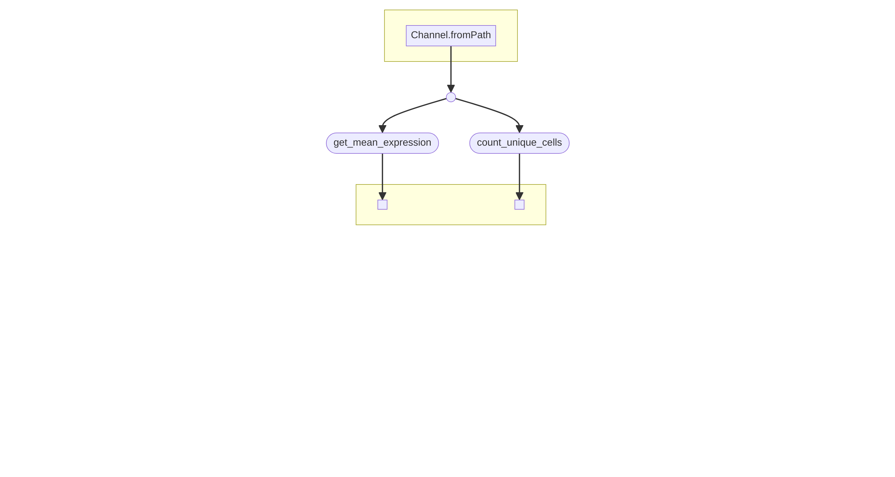

This repo contains code to query data from [CZ CellXGene Discover](https://cellxgene.cziscience.com/) by using [CZ CellXGene Census API](https://chanzuckerberg.github.io/cellxgene-census//) and [TileDB-SOMA API](https://github.com/single-cell-data/TileDB-SOMA).  

## Description of the pipeline

The program [https://github.com/indapa/indapa-CellXGene/blob/master/bin/cellXgene_census_mean_exp.py](cellXgene_census_mean_exp.py) queries the CZ CellXGene Census API and retrieves the mean expression of genes in a given cell type. The output is a CSV file with the mean expression values for each gene in the specified cell type. It also calculates the number of unique cells retrieved for tissue,cell type pair. Results are written to a CSV file.




## Running the pipeline

The easiest way to run this pipeline is on Sequera Cloud. I personally recommend setting up [Batch Forge](https://docs.seqera.io/platform/25.1/compute-envs/aws-batch#tower-forge). Note, you need to have your own AWS account to set this up and you will be charged for the resources you use.

If you want to run the pipeline with the test samplesheet in the repo, you can spin up a Codespace and then run the following command in the terminal:

```
nextflow run main.nf  --samplesheet Samplesheets/samplesheet-test.csv  --output_dir /workspaces/indapa-CellXGene
```


## Parameters required for pipeline

Required parameters are output_dir and samplesheet. An example [samplesheet](https://github.com/indapa/indapa-CellXGene/blob/master/Samplesheets/samplesheet-test.csv) is provided in the repo. 

See the [schema](https://github.com/indapa/indapa-CellXGene/blob/master/nextflow_schema.json) for the required parameters.


