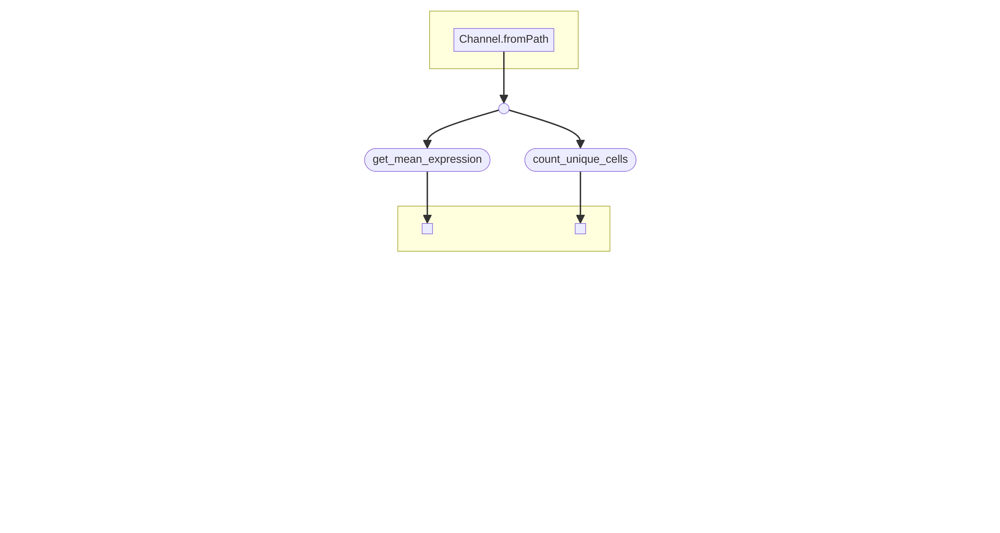

This repo contains code to query data from [CZ CellXGene Discover](https://cellxgene.cziscience.com/) by using [CZ CellXGene Census API](https://chanzuckerberg.github.io/cellxgene-census//) and [TileDB-SOMA API](https://github.com/single-cell-data/TileDB-SOMA).  

## Running the Streamlit app with uv

The repository now includes a `pyproject.toml` so you can use [uv](https://docs.astral.sh/uv/) to create the environment and run the Streamlit app locally.

Install uv if needed:

```bash
curl -LsSf https://astral.sh/uv/install.sh | sh
```

Create or update the virtual environment for the Streamlit app from the repository root:

```bash
uv sync
```

Start the app:

```bash
uv run streamlit run cellXgene_streamlit.py
```

Streamlit will print a local URL, typically `http://localhost:8501`.

The app reads example CSV files from `ExampleData/`, which is already present in this repository. It also expects `HGNC_protein_coding_genes.txt` to be available in the repository root alongside `cellXgene_streamlit.py`.

If `HGNC_protein_coding_genes.txt` is missing, the app can fail during startup with a `FileNotFoundError` before the UI renders, even if the `ExampleData/` folder is present. If the app starts but shows no data-driven options, verify that `ExampleData/` contains `*_reformatted.csv` files and that `HGNC_protein_coding_genes.txt` is present.

For users keeping older workflows, `requirements.txt` remains in the repository for backward compatibility, but `pyproject.toml` is now the primary dependency definition for local uv-based development.

If you also want the pipeline-specific dependencies from `requirements.txt`, install the optional extra:

```bash
uv sync --extra pipeline
```

Note that the pipeline extra includes `tiledbsoma`, which may require additional native build support on some machines.

## Description of the pipeline

The program [cellXgene_census_mean_exp.py](https://github.com/indapa/indapa-CellXGene/blob/master/bin/cellXgene_census_mean_exp.py) queries the CZ CellXGene Census API and retrieves the mean expression all genes in a given cell type in a given tissue. The output is a CSV file with the mean expression values for each gene in the specified cell type. The program [cellXGene_census_count_unique_cells.py](https://github.com/indapa/indapa-CellXGene/blob/master/bin/cellXGene_census_count_unique_cells.py) counts the number of unique cells retrieved for tissue,cell type pair.  Results are written to a CSV file.




## Running the pipeline

The easiest way to run this pipeline in production  is on Seqera Cloud. I personally recommend setting up [Batch Forge](https://docs.seqera.io/platform/25.1/compute-envs/aws-batch#tower-forge). Note, you need to have your own AWS account to set this up and you will be charged for the resources you use.

If you want to run the pipeline with the test samplesheet in the repo, you can spin up a Codespace and then run the following command in the terminal:

```
nextflow run main.nf  --samplesheet Samplesheets/samplesheet-test.csv  --output_dir /workspaces/indapa-CellXGene
```


## Parameters required for pipeline

Required parameters are output_dir and samplesheet. An example [samplesheet](https://github.com/indapa/indapa-CellXGene/blob/master/Samplesheets/samplesheet-test.csv) is provided in the repo. 

See the [schema](https://github.com/indapa/indapa-CellXGene/blob/master/nextflow_schema.json) for the required parameters.


